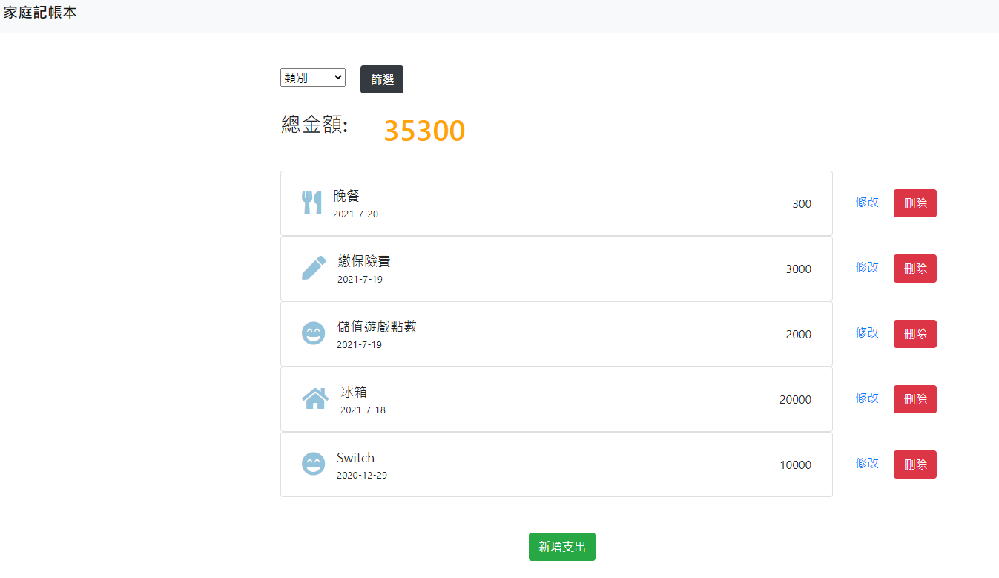

# Restaurant List

AlphaCamp Project: Restaurant-List
使用Node.js、Express、Mongoose等開發工具所打造的網站。

## 網站主要功能

- 使用者可在首頁看到所有支出、總金額及各項功能。
- 使用者可點擊編輯對特定支出資料進行修改。
- 使用者可點擊刪除以移除特定支出資料。
- 使用者可點擊新增以填寫支出資料，並新增該資料至首頁。
- 使用者可提交表單篩選支出類別。

## 專案畫面截圖


## 開發環境

- Visual Studio Code
- Express
- Express-Handlebars
- MongoDB
- mongoose
- nodemon
- body-parser
- method-override

## 安裝專案

### 1. 開啟終端機，Clone此專案至本機

```
git clone https://github.com/HowNLuo/Expense-Tracker.git
```

### 2. 終端機輸入以下指令進入專案

```
cd expense-tracker
```

### 3. 終端機輸入以下指令以安裝npm套件

```
npm install
```

### 4. 加入種子資料

```
npm run seed
```

### 5. 終端機輸入以下指令啟動伺服器

```
npm run dev
```

### 6. 請至瀏覽器輸入 http://localhost:3000 開始使用網站

## 專案開發人員

> [HowNLuo](https://github.com/HowNLuo)